- install
- `npx create-react-app test`
---

## clean up & prepare 
- delete `App.test.js index.css logo.svg serviceWorker.js`
- alse, update `index.js App.js`, we don't need to import
- update App.js
```js
import React from 'react';
import './App.css';

function App() {
  return (
    <div className="App">
      <h1>Hello from React</h1>
    </div>
  );
}

export default App;
```
-
- delete App.css's content
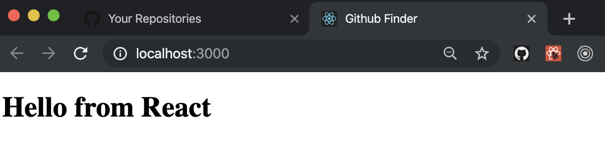
- import my own App.css
- so copy that, and replace original App.css by current 
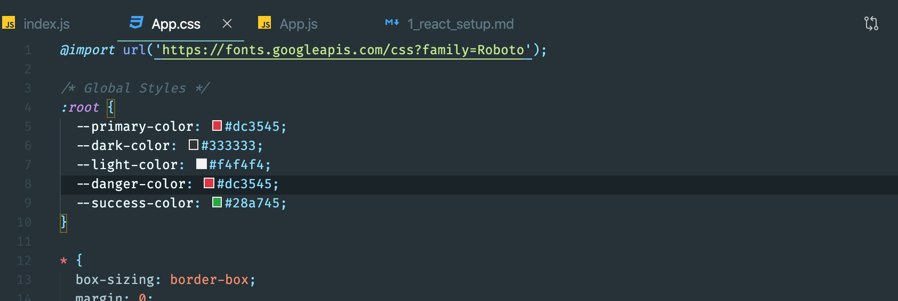
- now we can see the font has changed
- 
- next, we turn to App function to a class
- update App.js
```js
import React, { Component } from 'react';
import './App.css';

class App extends Component {
  render() {
    return (
      <div className="App">
        <h1>Hello from React</h1>
      </div>
    );
  }
}

export default App;
```
---

## Intro To JSX & Fragments
- update App.js
```js
class App extends Component {
  render() {
    return (
      <div className="App">
        <h1>Hello from React</h1>
        <label htmlfor='name'>Name</label>
      </div>
      <h2>Good bye</h2>
    );
  }
}
```
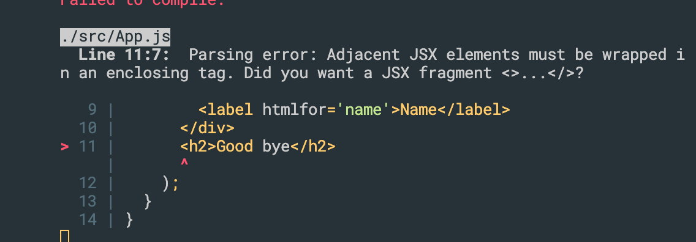
- for react, must only have one parent tag, so move h2 into div
- update
```js
class App extends Component {
  render() {
    return (
      <div className="App">
        <h1>Hello from React</h1>
        <h2>Good bye</h2>
      </div>

    );
  }
}
```
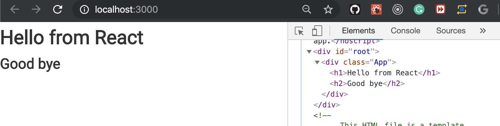
- we can see h1, h2 in <div class='App'>
- we can also use `React.Fragment`
- update App.js
```js
import React, { Component } from 'react';
import './App.css';

class App extends Component {
  render() {
    return (
      <React.Fragment>
        <h1>Hello from React</h1>
        <h2>Good bye</h2>
      </React.Fragment>
    );
  }
}

export default App;
```
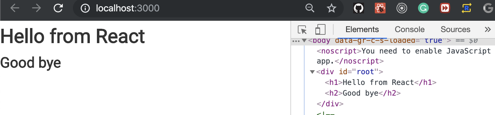
- this time, we don't see <div class='App'>
- the other way to do that:
- update
```js
import React, { Component, Fragment } from 'react';
import './App.css';

class App extends Component {
  render() {
    return (
      <Fragment>
        <h1>Hello from React</h1>
        <h2>Good bye</h2>
      </Fragment>
    );
  }
}

export default App;
```
- we import Fragment from react
- or we can use `<> ... </>`
- update
```js
import React, { Component, Fragment } from 'react';
import './App.css';

class App extends Component {
  render() {
    return (
      <>
        <h1>Hello from React</h1>
        <h2>Good bye</h2>
      </>
    );
  }
}

export default App;
```
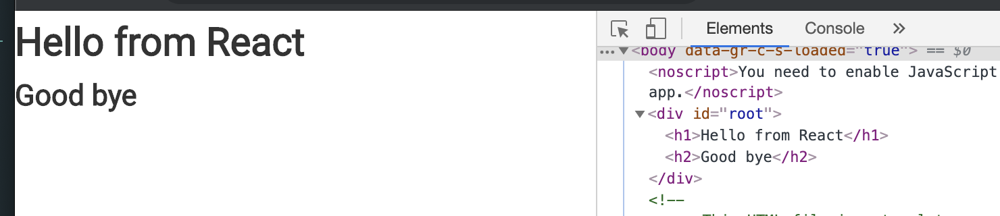
- it also works
- now we introduce the wired way:
- update App.js
```js
import React, { Component } from 'react';
import './App.css';

class App extends Component {
  render() {
    return React.createElement(
      'div',
      { className: 'App' },
      React.createElement('h1', null, 'Hello from React')
    );
  }
}

export default App;
```
- this is same result.
---

## Expressions & Conditionals In JSX
- update App.js
```js
class App extends Component {
  render() {
    const name = 'John Smith';

    return (
      <div className="App">
        <h1>Hello {name}</h1>
      </div>
    );
  }
}
```
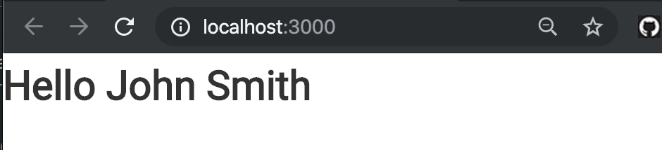
- or we can do:
```js
class App extends Component {
  render() {
    const name = 'John Smith';

    return (
      <div className="App">
        <h1>Hello {1 + 1}</h1>
      </div>
    );
  }
}
```
- output: 2
- update
```js
class App extends Component {
  render() {
    const name = 'John Smith';

    return (
      <div className="App">
        <h1>Hello {name.toUpperCase()}</h1>
      </div>
    );
  }
}
```
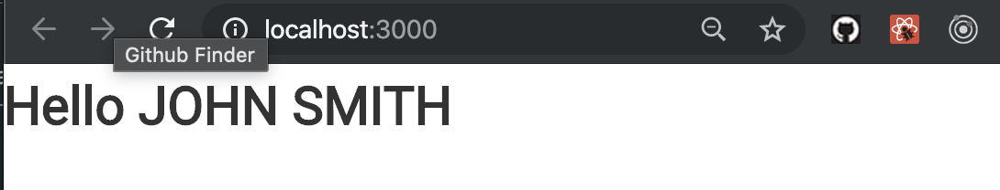
-
- or, we can do
- 
```js
class App extends Component {
  render() {
    const name = 'John Smith';

    const foo = () => 'Bar';

    return (
      <div className="App">
        <h1>Hello {foo()}</h1>
      </div>
    );
  }
}
```
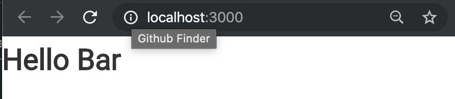
---
- or:
```js
class App extends Component {
  foo = () => 'Bars';

  render() {
    const name = 'John Smith';

    return (
      <div className="App">
        <h1>Hello {this.foo()}</h1>
      </div>
    );
  }
}
```
- the same result.
--- 
- conditional expression
- 
```js
class App extends Component {

  render() {
    const name = 'John Smith';
    const loading = true;

    if (loading) {
      return <h4>Loading...</h4>
    }

    return (
      <div className="App">
        <h1>Hello {name}</h1>
      </div>
    );
  }
}
```
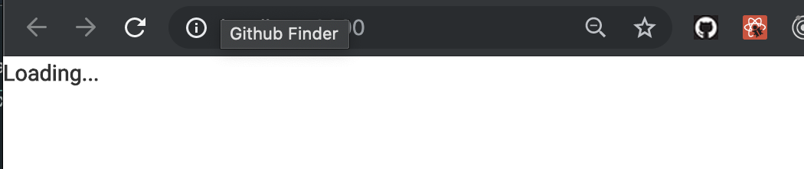
---
-
- ternary expression
```js
class App extends Component {

  render() {
    const name = 'John Smith';
    const loading = true;

    return (
      <div className="App">
        <h1>My App</h1>
        {loading ? <h4>Loading...</h4> : <h1>Hello {name}</h1>}
      </div>
    );
  }
}
```
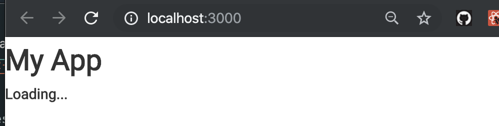
- change to false
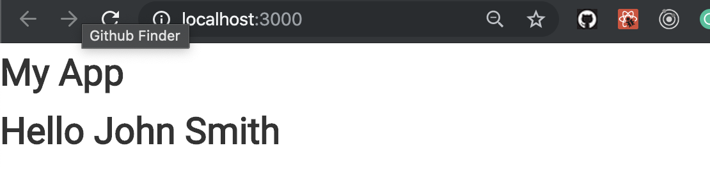

```js
```
```js
```
```js
```
```js
```
```js
```
```js
```
