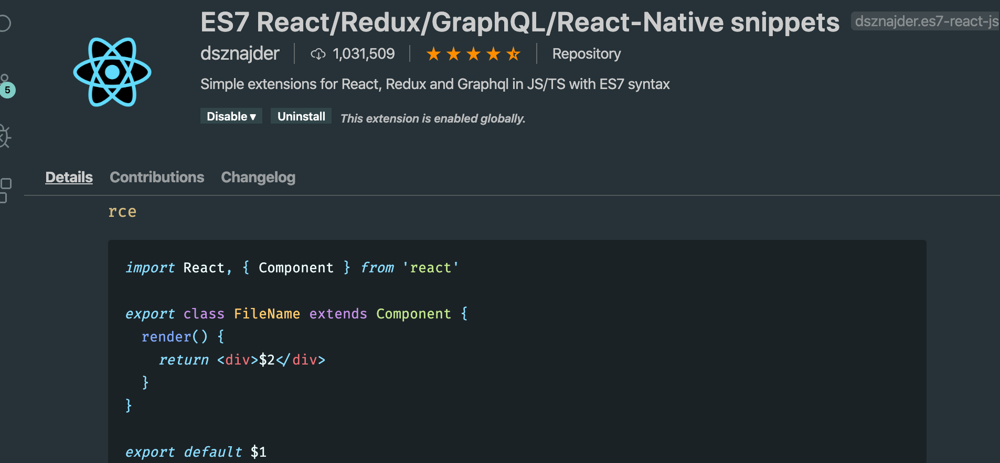
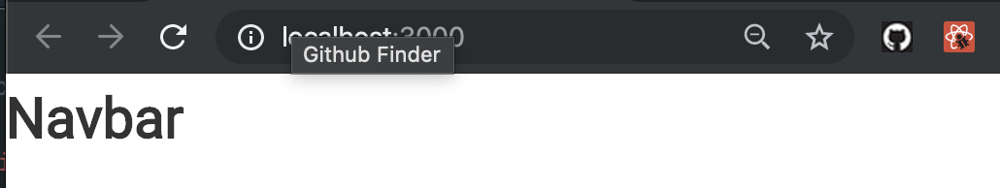
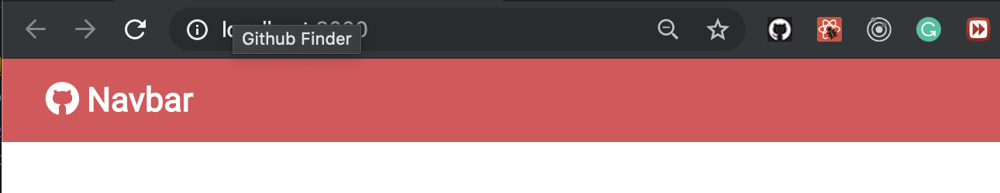
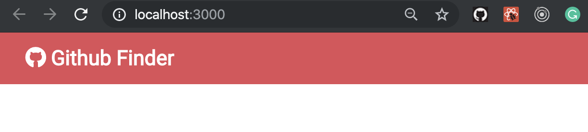
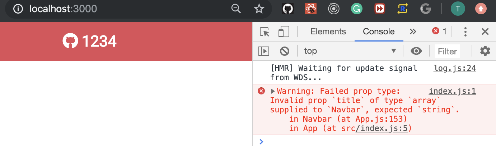
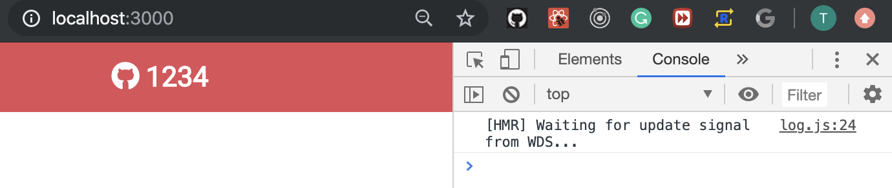
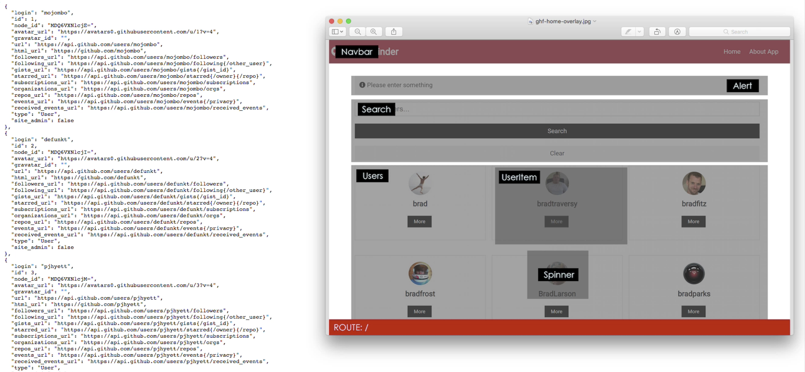

## Components Props && PropTyeps
- create components folder in src folder
- create another folder `layout` in `components`
- create Navbar.js in `layout` folder
- 
- install ES7 React/Redux, but I installed it
- in Navbar.js, input `RCE` 

```js
import React, { Component } from 'react'

export class Navbar extends Component {
    render() {
        return (
            <div >
                <h1>Navbar</h1>
            </div>
        )
    }
}
export default Navbar
```
- update App.js
- 
```js
class App extends Component {
  render() {
    return (
      <div className="App">
        <Navbar />
      </div>
    );
  }
}
```

---
- import fontawesome
```js
<link 
    rel="stylesheet" 
    href="https://use.fontawesome.com/releases/v5.6.3/css/all.css" 
    integrity="sha384-UHRtZLI+pbxtHCWp1t77Bi1L4ZtiqrqD80Kn4Z8NTSRyMA2Fd33n5dQ8lWUE00s/" 
    crossorigin="anonymous"
/>
```
- update Navbar.js
```js
import React, { Component } from 'react'

export class Navbar extends Component {
    render() {
        return (
            <nav className='navbar bg-primary'>
                <h1>
                    <i className='fab fa-github' /> Navbar
                </h1>
            </nav>
        );
    }
}
export default Navbar
```

- i don't want to use "Navbar" as my title
- how to use Props?
- 
- update Navbar.js
```js
import React, { Component } from 'react'
export class Navbar extends Component {
    render() {
        return (
            <nav className='navbar bg-primary'>
                <h1>
                    <i className={this.props.icon} /> {this.props.title}
                </h1>
            </nav>
        );
    }
}
export default Navbar
```
-
- App.js
```js
//Components Props && PropTyeps
import React, { Component } from 'react';
import Navbar from './components/layout/Navbar';
import './App.css';

class App extends Component {
  render() {
    return (
      <div className="App">
        <Navbar title="Github Finder" icon='fab fa-github' />
        {/* 'fab fa-github' , is importing from fontawesome  */}
      </div>
    );
  }
}
export default App;
```

---

- 2nd way:
- Navbar.js
```js
import React, { Component } from 'react'
export class Navbar extends Component {
    static defaultProps = {
        title: 'Github Finder',
        icon: 'fab fa-github'
    }

    render() {
        return (
            <nav className='navbar bg-primary'>
                <h1>
                    <i className={this.props.icon} /> {this.props.title}
                </h1>
            </nav>
        );
    }
}
export default Navbar
```
-
- update App.js
```js
//Components Props && PropTyeps
import React, { Component } from 'react';
import Navbar from './components/layout/Navbar';
import './App.css';

class App extends Component {
  render() {
    return (
      <div className="App">
        <Navbar />
        {/* <Navbar title="Github Finder" icon='fab fa-github' /> */}
        {/* 'fab fa-github' , is importing from fontawesome  */}
      </div>
    );
  }
}
export default App;
```
- the same result
- input `impt` in Navbar.js
- `import PropTypes from 'prop-types'`
- update Navbar.js
```js
import React, { Component } from 'react'
import PropTypes from 'prop-types'
export class Navbar extends Component {
    static defaultProps = {
        title: 'Github Finder',
        icon: 'fab fa-github'
    };

    static propTypes = {
        title: PropTypes.string.isRequired,
        icon: PropTypes.string.isRequired
    };

    render() {
        return (
            <nav className='navbar bg-primary'>
                <h1>
                    <i className={this.props.icon} /> {this.props.title}
                </h1>
            </nav>
        );
    }
}
export default Navbar
```
- now what I want to do is pass something in that is not a string and see what happen?
- update App.js
```js
class App extends Component {
  render() {
    const numbers = [1, 2, 3, 4];

    return (
      <div className="App">
        <Navbar title={numbers} />
        {/* <Navbar title="Github Finder" icon='fab fa-github' /> */}
        {/* 'fab fa-github' , is importing from fontawesome  */}
      </div>
    );
  }
}
```

- then we have a warning.
- if we fix Navbar.js
```js
export class Navbar extends Component {
    static defaultProps = {
        title: 'Github Finder',
        icon: 'fab fa-github'
    };

    static propTypes = {
        title: PropTypes.array.isRequired,
        icon: PropTypes.string.isRequired
    };

    render() {
        return (
            <nav className='navbar bg-primary'>
                <h1>
                    <i className={this.props.icon} /> {this.props.title}
                </h1>
            </nav>
        );
    }
}
```

- this time, we change the type to be array, so there is no warning
---


## Getting Started With Component State

