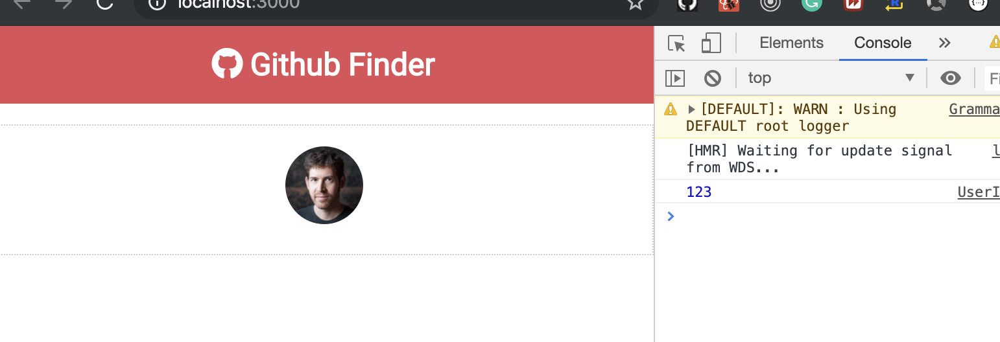
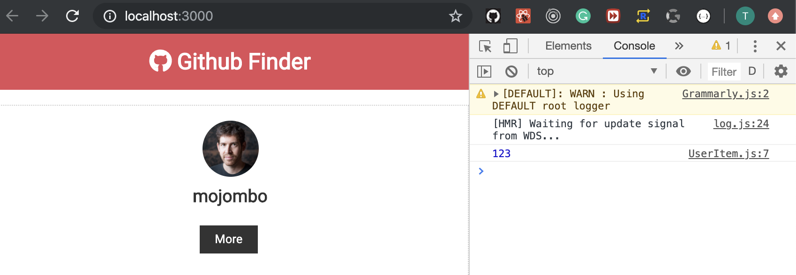
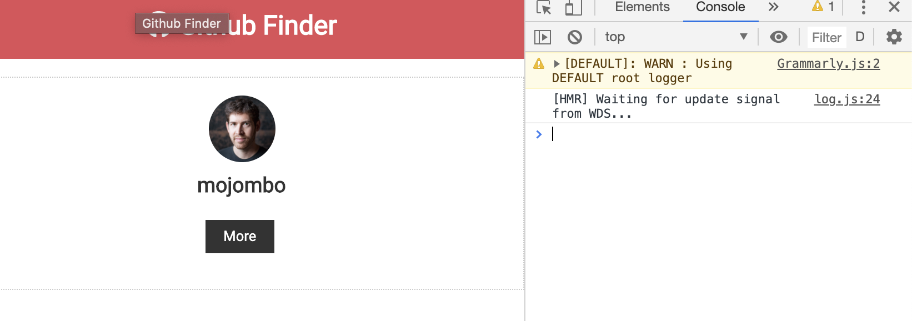
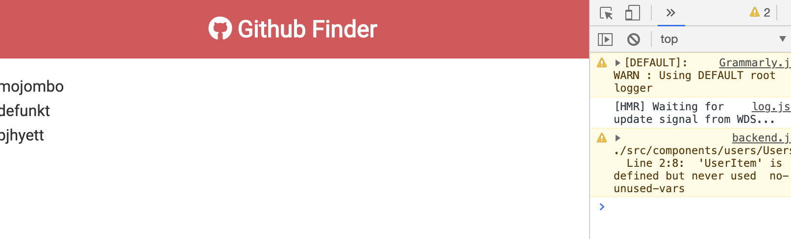
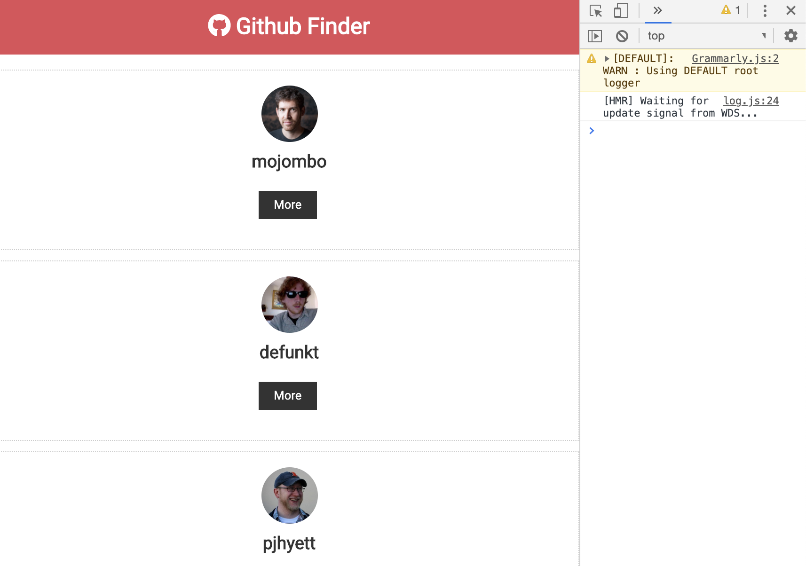
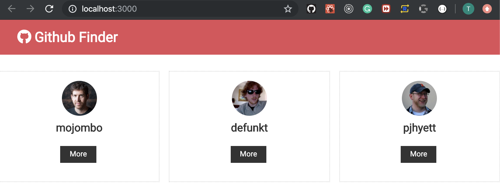
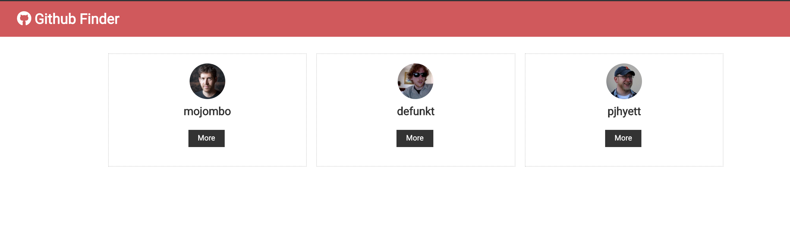

## Components Props && PropTyeps
- create components folder in src folder
- create another folder `layout` in `components`
- create Navbar.js in `layout` folder
- 
- install ES7 React/Redux, but I installed it
- in Navbar.js, input `RCE` 

```js
import React, { Component } from 'react'

export class Navbar extends Component {
    render() {
        return (
            <div >
                <h1>Navbar</h1>
            </div>
        )
    }
}
export default Navbar
```
- update App.js
- 
```js
class App extends Component {
  render() {
    return (
      <div className="App">
        <Navbar />
      </div>
    );
  }
}
```

---
- import fontawesome
```js
<link 
    rel="stylesheet" 
    href="https://use.fontawesome.com/releases/v5.6.3/css/all.css" 
    integrity="sha384-UHRtZLI+pbxtHCWp1t77Bi1L4ZtiqrqD80Kn4Z8NTSRyMA2Fd33n5dQ8lWUE00s/" 
    crossorigin="anonymous"
/>
```
- update Navbar.js
```js
import React, { Component } from 'react'

export class Navbar extends Component {
    render() {
        return (
            <nav className='navbar bg-primary'>
                <h1>
                    <i className='fab fa-github' /> Navbar
                </h1>
            </nav>
        );
    }
}
export default Navbar
```

- i don't want to use "Navbar" as my title
- how to use Props?
- 
- update Navbar.js
```js
import React, { Component } from 'react'
export class Navbar extends Component {
    render() {
        return (
            <nav className='navbar bg-primary'>
                <h1>
                    <i className={this.props.icon} /> {this.props.title}
                </h1>
            </nav>
        );
    }
}
export default Navbar
```
-
- App.js
```js
//Components Props && PropTyeps
import React, { Component } from 'react';
import Navbar from './components/layout/Navbar';
import './App.css';

class App extends Component {
  render() {
    return (
      <div className="App">
        <Navbar title="Github Finder" icon='fab fa-github' />
        {/* 'fab fa-github' , is importing from fontawesome  */}
      </div>
    );
  }
}
export default App;
```

---

- 2nd way:
- Navbar.js
```js
import React, { Component } from 'react'
export class Navbar extends Component {
    static defaultProps = {
        title: 'Github Finder',
        icon: 'fab fa-github'
    }

    render() {
        return (
            <nav className='navbar bg-primary'>
                <h1>
                    <i className={this.props.icon} /> {this.props.title}
                </h1>
            </nav>
        );
    }
}
export default Navbar
```
-
- update App.js
```js
//Components Props && PropTyeps
import React, { Component } from 'react';
import Navbar from './components/layout/Navbar';
import './App.css';

class App extends Component {
  render() {
    return (
      <div className="App">
        <Navbar />
        {/* <Navbar title="Github Finder" icon='fab fa-github' /> */}
        {/* 'fab fa-github' , is importing from fontawesome  */}
      </div>
    );
  }
}
export default App;
```
- the same result
- input `impt` in Navbar.js
- `import PropTypes from 'prop-types'`
- update Navbar.js
```js
import React, { Component } from 'react'
import PropTypes from 'prop-types'
export class Navbar extends Component {
    static defaultProps = {
        title: 'Github Finder',
        icon: 'fab fa-github'
    };

    static propTypes = {
        title: PropTypes.string.isRequired,
        icon: PropTypes.string.isRequired
    };

    render() {
        return (
            <nav className='navbar bg-primary'>
                <h1>
                    <i className={this.props.icon} /> {this.props.title}
                </h1>
            </nav>
        );
    }
}
export default Navbar
```
- now what I want to do is pass something in that is not a string and see what happen?
- update App.js
```js
class App extends Component {
  render() {
    const numbers = [1, 2, 3, 4];

    return (
      <div className="App">
        <Navbar title={numbers} />
        {/* <Navbar title="Github Finder" icon='fab fa-github' /> */}
        {/* 'fab fa-github' , is importing from fontawesome  */}
      </div>
    );
  }
}
```

- then we have a warning.
- if we fix Navbar.js
```js
export class Navbar extends Component {
    static defaultProps = {
        title: 'Github Finder',
        icon: 'fab fa-github'
    };

    static propTypes = {
        title: PropTypes.array.isRequired,
        icon: PropTypes.string.isRequired
    };

    render() {
        return (
            <nav className='navbar bg-primary'>
                <h1>
                    <i className={this.props.icon} /> {this.props.title}
                </h1>
            </nav>
        );
    }
}
```

- this time, we change the type to be array, so there is no warning
---


## Getting Started With Component State

- create a folder `users`
- `users/UserItem.js`
- now let's use a fake api, hard code
```js
import React, { Component } from 'react'


class UserItem extends Component {
    constructor() {
        super();
        console.log(123);
        this.state = {
            id: 'id',
            login: 'mojombo',
            avatar_url: 'https://avatars0.githubusercontent.com/u/1?v=4',
            html_url: 'https://github.com/mojombo'
        }
    }
    render() {
        return (
            <div className="card text-center">
                
            </div>
        )
    }
}
export default UserItem
```
-
- update App.js
```js
//Getting Started With Component State
import React, { Component } from 'react';
import Navbar from './components/layout/Navbar';
import UserItem from './components/users/UserItem';
import './App.css';
class App extends Component {
  render() {

    return (
      <div className="App">
        <Navbar />
        <UserItem />
      </div>
    );
  }
}
export default App;
```

-
- update UserItem.js
```js
import React, { Component } from 'react'
class UserItem extends Component {
    constructor() {
        super();
        console.log(123);
        this.state = {
            id: 'id',
            login: 'mojombo',
            avatar_url: 'https://avatars0.githubusercontent.com/u/1?v=4',
            html_url: 'https://github.com/mojombo'
        }
    }
    render() {
        return (
            <div className="card text-center">
                
                <h3>{this.state.login}</h3>
                <div>
                    <a href={this.state.html_url} className="btn btn-dark btn-sm my-1">
                        More
                    </a>
                </div>
            </div>
        )
    }
}
export default UserItem
```

-
- 2nd way:
- UserItem.js
```js

import React, { Component } from 'react'
class UserItem extends Component {
    state = {
        id: 'id',
        login: 'mojombo',
        avatar_url: 'https://avatars0.githubusercontent.com/u/1?v=4',
        html_url: 'https://github.com/mojombo'
    };

    render() {
        return (
            <div className="card text-center">
                
                <h3>{this.state.login}</h3>
                <div>
                    <a href={this.state.html_url} className="btn btn-dark btn-sm my-1">
                        More
                    </a>
                </div>
            </div>
        )
    }
}
export default UserItem
```
- same result.
-
-
- update UserItem.js
```js
import React, { Component } from 'react'
class UserItem extends Component {
    state = {
        id: 'id',
        login: 'mojombo',
        avatar_url: 'https://avatars0.githubusercontent.com/u/1?v=4',
        html_url: 'https://github.com/mojombo'
    };

    render() {
        const { login, avatar_url, html_url } = this.state;
        return (
            <div className="card text-center">
                
                <h3>{login}</h3>
                <div>
                    <a href={html_url} className="btn btn-dark btn-sm my-1">
                        More
                    </a>
                </div>
            </div>
        )
    }
}
export default UserItem
```

---


## Lists & Passing State With Props
- create users/Users.js 
```js
import React, { Component } from 'react';
class Users extends Component {
    state = {
        users: [
            {
                id: '1',
                login: 'mojombo',
                avatar_url: 'https://avatars0.githubusercontent.com/u/1?v=4',
                html_url: 'https://github.com/mojombo'
            },
            {
                id: '2',
                login: 'defunkt',
                avatar_url: 'https://avatars0.githubusercontent.com/u/2?v=4',
                html_url: 'https://github.com/defunkt'
            },
            {
                id: '3',
                login: 'pjhyett',
                avatar_url: 'https://avatars0.githubusercontent.com/u/3?v=4',
                html_url: 'https://github.com/pjhyett'
            }
        ]
    }
    render() {
        return (
            <div>
                {this.state.users.map(user => (
                    <div key={user.id}>{user.login}</div>
                ))}
            </div>
        )
    }
}
export default Users
```
- update App.js
`import Users from './components/users/Users';`

---

-
- update UserItem.js
```js
import React, { Component } from 'react'
class UserItem extends Component {

    render() {
        const { login, avatar_url, html_url } = this.props.user;
        return (
            <div className="card text-center">
                
                <h3>{login}</h3>
                <div>
                    <a href={html_url} className="btn btn-dark btn-sm my-1">
                        More
                    </a>
                </div>
            </div>
        )
    }
}
export default UserItem
```
-
- Users import UserItem
- update Users.js
```js
import React, { Component } from 'react';
import UserItem from './UserItem';
class Users extends Component {
    state = {
        users: [
            {
                id: '1',
                login: 'mojombo',
                avatar_url: 'https://avatars0.githubusercontent.com/u/1?v=4',
                html_url: 'https://github.com/mojombo'
            },
            {
                id: '2',
                login: 'defunkt',
                avatar_url: 'https://avatars0.githubusercontent.com/u/2?v=4',
                html_url: 'https://github.com/defunkt'
            },
            {
                id: '3',
                login: 'pjhyett',
                avatar_url: 'https://avatars0.githubusercontent.com/u/3?v=4',
                html_url: 'https://github.com/pjhyett'
            }
        ]
    }
    render() {
        return (
            <div>
                {this.state.users.map(user => (
                    <UserItem key={user.id} user={user} />
                ))}
            </div>
        )
    }
}
export default Users
```

---


- update `Users.js`
```js
import React, { Component } from 'react';
import UserItem from './UserItem';
class Users extends Component {
    state = {
        users: [
            {
                id: '1',
                login: 'mojombo',
                avatar_url: 'https://avatars0.githubusercontent.com/u/1?v=4',
                html_url: 'https://github.com/mojombo'
            },
            {
                id: '2',
                login: 'defunkt',
                avatar_url: 'https://avatars0.githubusercontent.com/u/2?v=4',
                html_url: 'https://github.com/defunkt'
            },
            {
                id: '3',
                login: 'pjhyett',
                avatar_url: 'https://avatars0.githubusercontent.com/u/3?v=4',
                html_url: 'https://github.com/pjhyett'
            }
        ]
    }
    render() {
        return (
            <div style={userStyle}>
                {this.state.users.map(user => (
                    <UserItem key={user.id} user={user} />
                ))}
            </div>
        )
    }
}
const userStyle = {
    display: 'grid',
    gridTemplateColumns: 'repeat(3, 1fr)',
    gridGap: '1rem'
}
export default Users
```
- 
- App.js
```js
//Getting Started With Component State
import React, { Component } from 'react';
import Navbar from './components/layout/Navbar';
import Users from './components/users/Users';
import './App.css';

class App extends Component {
  render() {

    return (
      <div className="App">
        <Navbar />
        <Users />
      </div>
    );
  }
}
export default App;
```

---


- update App
```js
//Getting Started With Component State
import React, { Component } from 'react';
import Navbar from './components/layout/Navbar';
import Users from './components/users/Users';
import './App.css';

class App extends Component {
  render() {

    return (
      <div className="App">
        <Navbar />
        <div className='container'>
          <Users />
        </div>

      </div>
    );
  }
}
export default App;
```

---


## Stateless Funcional Components
- Good for simple content
-
- update Navbar.js
```js
//Stateless Funcional Components
import React from 'react'
import PropTypes from 'prop-types'
const Navbar = (props) => {
    return (
        <nav className='navbar bg-primary'>
            <h1>
                <i className={props.icon} /> {props.title}
            </h1>
        </nav>
    );
}
/* 
1. we pass defaultProps into Navbar self, Navbar receive props from self, 
2. and assign props.icon to className, and assigns props.title to value
*/

Navbar.defaultProps = {
    title: 'Github Finder',
    icon: 'fab fa-github'
};

Navbar.propTypes = {
    title: PropTypes.string.isRequired,
    icon: PropTypes.string.isRequired
};

export default Navbar
```
---


## refactoring UserItem.js
```js
//Stateless Funcional Components
import React from 'react';
import PropTypes from 'prop-types'

const UserItem = ({ user: { login, avatar_url, html_url } }) => {

    return (
        <div className="card text-center">
            
            <h3>{login}</h3>
            <div>
                <a href={html_url} className="btn btn-dark btn-sm my-1">
                    More
                    </a>
            </div>
        </div>
    )

}

UserItem.prototype = {
    user: PropTypes.object.isRequired,
}
export default UserItem
```
-
- update Navbar.js
```js
//Stateless Funcional Components
import React from 'react'
import PropTypes from 'prop-types'
const Navbar = ({ icon, title }) => {
    return (
        <nav className='navbar bg-primary'>
            <h1>
                <i className={icon} /> {title}
            </h1>
        </nav>
    );
}

Navbar.defaultProps = {
    title: 'Github Finder',
    icon: 'fab fa-github'
};

Navbar.propTypes = {
    title: PropTypes.string.isRequired,
    icon: PropTypes.string.isRequired
};

export default Navbar
```
- still same result