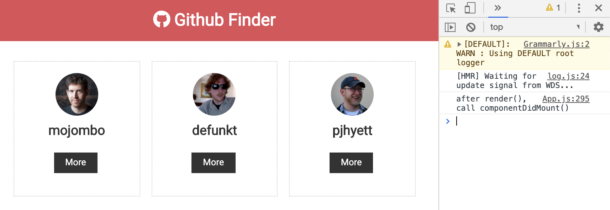
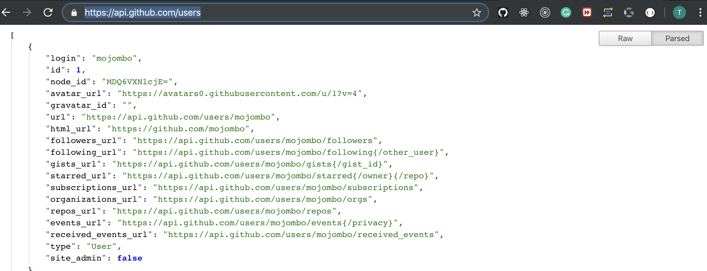
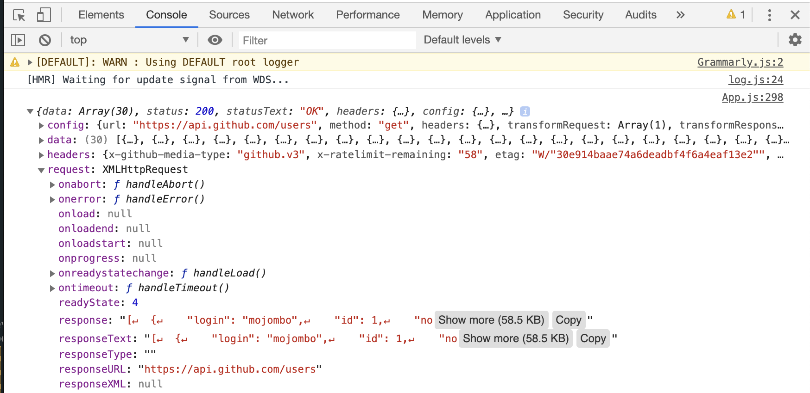
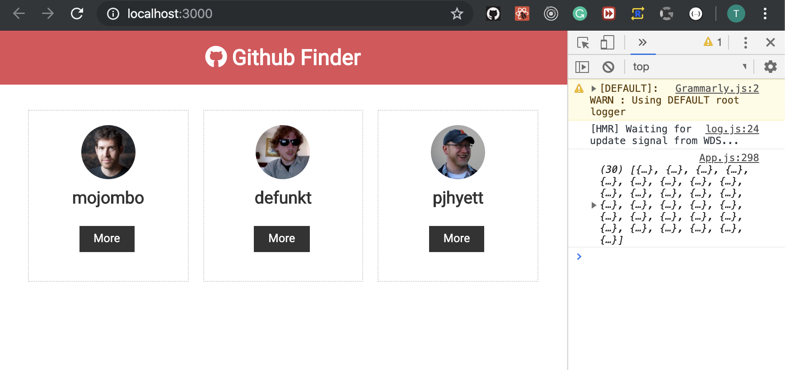

## HTTP Requests & Updating State

- update App
```js
//HTTP Requests & Updating State
import React, { Component } from 'react';
import Navbar from './components/layout/Navbar';
import Users from './components/users/Users';
import './App.css';

class App extends Component {
  componentDidMount() {
    console.log('after render(), call componentDidMount()');
  }

  render() {
    return (
      <div className="App">
        <Navbar />
        <div className='container'>
          <Users />
        </div>

      </div>
    );
  }
}
export default App;
```

---


#### install axios
- `npm i axios`
-
- input `https://api.github.com/users`

-
- update App.js
```js
//HTTP Requests & Updating State
import React, { Component } from 'react';
import Navbar from './components/layout/Navbar';
import Users from './components/users/Users';
import axios from 'axios';
import './App.css';

class App extends Component {
  componentDidMount() {
    axios.get('https://api.github.com/users')
      .then((res) => { console.log(res) });
  }

  render() {
    return (
      <div className="App">
        <Navbar />
        <div className='container'>
          <Users />
        </div>

      </div>
    );
  }
}
export default App;
```
- output: `response`

- then, output: `res.data`
```js
//HTTP Requests & Updating State
import React, { Component } from 'react';
import Navbar from './components/layout/Navbar';
import Users from './components/users/Users';
import axios from 'axios';
import './App.css';

class App extends Component {
  componentDidMount() {
    // console.log('after render(), call componentDidMount()');
    axios.get('https://api.github.com/users')
      .then((res) => { console.log(res.data) });
  }

  render() {
    return (
      <div className="App">
        <Navbar />
        <div className='container'>
          <Users />
        </div>

      </div>
    );
  }
}
export default App;
```

---

-
- now we delete hard codes from User.js
```js
    state = {
        users: [
            {
                id: '1',
                login: 'mojombo',
                avatar_url: 'https://avatars0.githubusercontent.com/u/1?v=4',
                html_url: 'https://github.com/mojombo'
            },
            {
                id: '2',
                login: 'defunkt',
                avatar_url: 'https://avatars0.githubusercontent.com/u/2?v=4',
                html_url: 'https://github.com/defunkt'
            },
            {
                id: '3',
                login: 'pjhyett',
                avatar_url: 'https://avatars0.githubusercontent.com/u/3?v=4',
                html_url: 'https://github.com/pjhyett'
            }
        ]
    }
```
- update App.js
```js
//HTTP Requests & Updating State
import React, { Component } from 'react';
import Navbar from './components/layout/Navbar';
import Users from './components/users/Users';
import axios from 'axios';
import './App.css';

class App extends Component {
  state = {
    users: [],
    loading: false
  }

  async componentDidMount() {
    this.setState({ loading: true });
    const res = await axios.get('https://api.github.com/users');

    // console.log(res.data);
    this.setState({ users: res.data, loading: false });
  }

  render() {
    return (
      <div className="App">
        <Navbar />
        <div className='container'>
          <Users loading={this.state.loading} users={this.state.users} />
        </div>

      </div>
    );
  }
}
export default App;
```
-
- we passing props to `Users.js`, by calling axios.get() method

