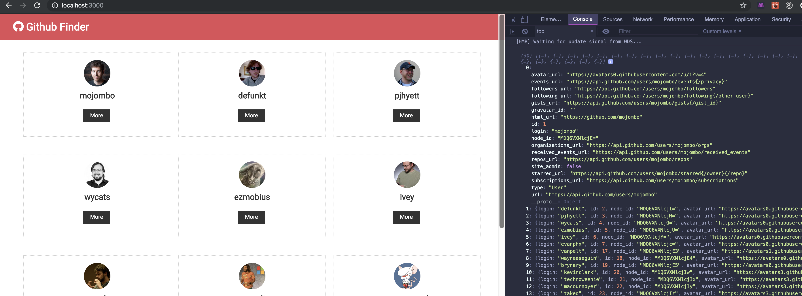
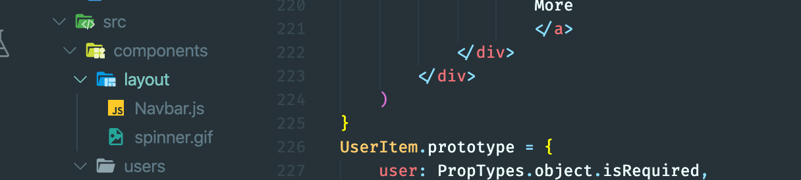
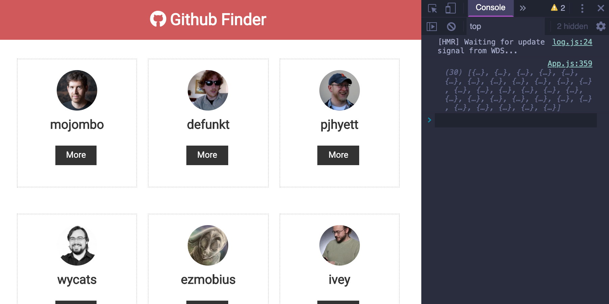
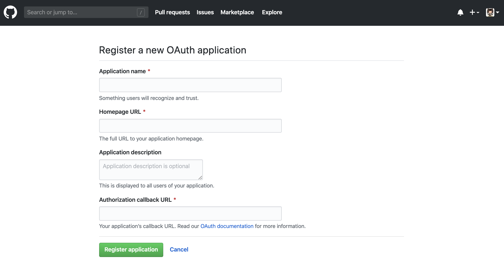
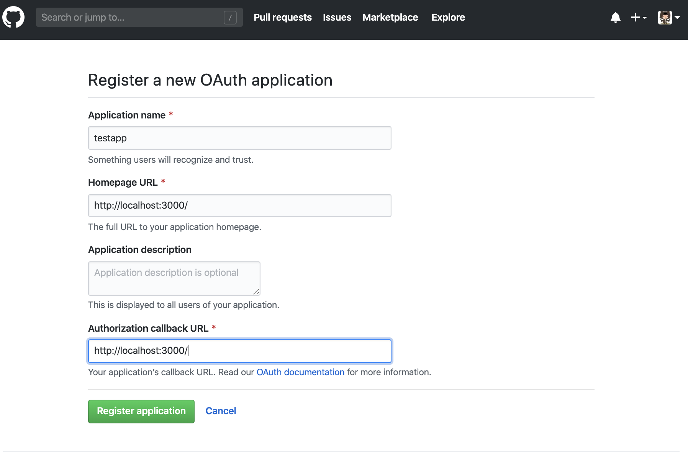
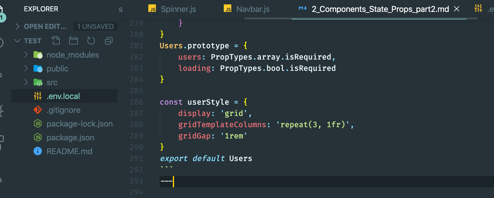
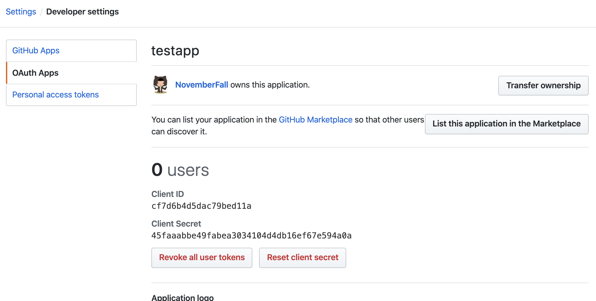
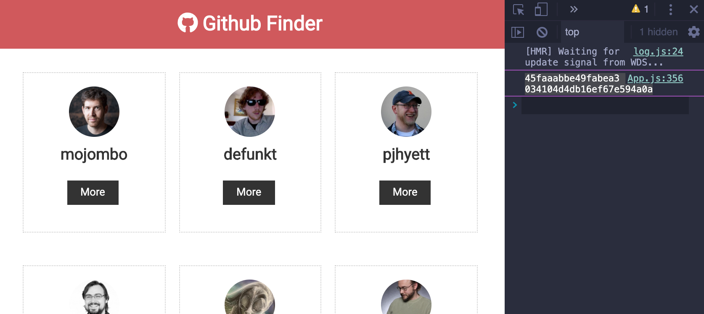

## HTTP Requests & Updating State

- update App
```js
//HTTP Requests & Updating State
import React, { Component } from 'react';
import Navbar from './components/layout/Navbar';
import Users from './components/users/Users';
import './App.css';

class App extends Component {
  componentDidMount() {
    console.log('after render(), call componentDidMount()');
  }

  render() {
    return (
      <div className="App">
        <Navbar />
        <div className='container'>
          <Users />
        </div>

      </div>
    );
  }
}
export default App;
```

---


#### install axios
- `npm i axios`
-
- input `https://api.github.com/users`

-
- update App.js
```js
//HTTP Requests & Updating State
import React, { Component } from 'react';
import Navbar from './components/layout/Navbar';
import Users from './components/users/Users';
import axios from 'axios';
import './App.css';

class App extends Component {
  componentDidMount() {
    axios.get('https://api.github.com/users')
      .then((res) => { console.log(res) });
  }

  render() {
    return (
      <div className="App">
        <Navbar />
        <div className='container'>
          <Users />
        </div>

      </div>
    );
  }
}
export default App;
```
- output: `response`

- then, output: `res.data`
```js
//HTTP Requests & Updating State
import React, { Component } from 'react';
import Navbar from './components/layout/Navbar';
import Users from './components/users/Users';
import axios from 'axios';
import './App.css';

class App extends Component {
  componentDidMount() {
    // console.log('after render(), call componentDidMount()');
    axios.get('https://api.github.com/users')
      .then((res) => { console.log(res.data) });
  }

  render() {
    return (
      <div className="App">
        <Navbar />
        <div className='container'>
          <Users />
        </div>

      </div>
    );
  }
}
export default App;
```

---

-
- now we delete hard codes from User.js
```js
    state = {
        users: [
            {
                id: '1',
                login: 'mojombo',
                avatar_url: 'https://avatars0.githubusercontent.com/u/1?v=4',
                html_url: 'https://github.com/mojombo'
            },
            {
                id: '2',
                login: 'defunkt',
                avatar_url: 'https://avatars0.githubusercontent.com/u/2?v=4',
                html_url: 'https://github.com/defunkt'
            },
            {
                id: '3',
                login: 'pjhyett',
                avatar_url: 'https://avatars0.githubusercontent.com/u/3?v=4',
                html_url: 'https://github.com/pjhyett'
            }
        ]
    }
```
- update App.js
```js
//HTTP Requests & Updating State
import React, { Component } from 'react';
import Navbar from './components/layout/Navbar';
import Users from './components/users/Users';
import axios from 'axios';
import './App.css';

class App extends Component {
  state = {
    users: [],
    loading: false
  }

  async componentDidMount() {
    this.setState({ loading: true });
    const res = await axios.get('https://api.github.com/users');

    // console.log(res.data);
    this.setState({ users: res.data, loading: false });
  }

  render() {
    return (
      <div className="App">
        <Navbar />
        <div className='container'>
          <Users loading={this.state.loading} users={this.state.users} />
        </div>

      </div>
    );
  }
}
export default App;
```
-
- we first passing `res.data` into `users`, call the `setState()` and res.data is an array
- we assign res.data to the array `users:[]`
- from app.js, we passing props to `Users.js`, by calling axios.get() method
-
-
- now look at `User.js`
```js
//HTTP Requests & Updating State
import React, { Component } from 'react';
import UserItem from './UserItem';
class Users extends Component {
    render() {
        return (
            <div style={userStyle}>
                {this.props.users.map(user => (
                    <UserItem key={user.id} user={user} />
                ))}
            </div>
        )
    }
}

const userStyle = {
    display: 'grid',
    gridTemplateColumns: 'repeat(3, 1fr)',
    gridGap: '1rem'
}

export default Users
```
- `Users` component get the user data from props, from `App`
- Users call the `Map()` method to create a new array
-
-
- now look at `UserItem.js`
```js
//Stateless Funcional Components
import React from 'react';
import PropTypes from 'prop-types'
const UserItem = ({ user: { login, avatar_url, html_url } }) => {
    return (
        <div className="card text-center">
            
            <h3>{login}</h3>
            <div>
                <a href={html_url} className="btn btn-dark btn-sm my-1">
                    More
                    </a>
            </div>
        </div>
    )
}
UserItem.prototype = {
    user: PropTypes.object.isRequired,
}
export default UserItem
```
- `const UserItem = ({ user: { login, avatar_url, html_url } }) => `, inside `({user: ...})` we just assign `login, avatar_url, html_url` from `Users`, from `res.data` in App.js
- then, we render a new component

---


## Spinner Component & Refactoring
- added `spinner.gif` into layout folder

- create `Spinner.js` in layout
```js
import React, { Fragment } from 'react';
import spinner from './spinner.gif';

const Spinner = () => {
    return (
        <Fragment>
            
        </Fragment>
    )
}
export default Spinner
```

-
- refactoring User.js
```js
//Spinner Component & Refactoring
import React, { Component } from 'react';
import UserItem from './UserItem';
import Spinner from '../layout/Spinner';
import PropTypes from 'prop-types'

const Users = ({ users, loading }) => {
    if (loading) {
        return <Spinner />
    } else {
        return (
            <div style={userStyle}>
                {users.map(user => (
                    <UserItem key={user.id} user={user} />
                ))}
            </div>
        )
    }
}
Users.prototype = {
    users: PropTypes.array.isRequired,
    loading: PropTypes.bool.isRequired
}

const userStyle = {
    display: 'grid',
    gridTemplateColumns: 'repeat(3, 1fr)',
    gridGap: '1rem'
}
export default Users
```
---


## Environment Variables

- input `github register application`


- go to `https://developer.github.com/apps/building-oauth-apps/` guide

- click `registerion`
-
- create enviornment variables

- `.env.local`
```js
REACT_APP_GITHUB_CILENT_ID='cf7d6b4d5dac79bed11a'
REACT_APP_GITHUB_CILENT_SECRET='45faaabbe49fabea3034104d4db16ef67e594a0a'
```
- Note: `.gitignore` has includled it

- update App
```js
//HTTP Requests & Updating State
import React, { Component } from 'react';
import Navbar from './components/layout/Navbar';
import Users from './components/users/Users';
import axios from 'axios';
import './App.css';

class App extends Component {
  state = {
    users: [],
    loading: false
  }

  async componentDidMount() {
    console.log(process.env.REACT_APP_GITHUB_CILENT_SECRET);
    this.setState({ loading: true });
    const res = await axios.get(`https://api.github.com/users?client_id=${process.env.REACT_APP_GITHUB_CILENT_ID}
    &client_secret=${process.env.REACT_APP_GITHUB_CILENT_SECRET}`);

    // console.log(res.data);
    this.setState({ users: res.data, loading: false });
  }

  render() {
    return (
      <div className="App">
        <Navbar />
        <div className='container'>
          <Users loading={this.state.loading} users={this.state.users} />
        </div>

      </div>
    );
  }
}
export default App;
```


