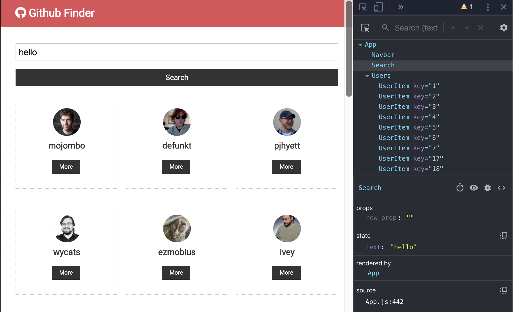
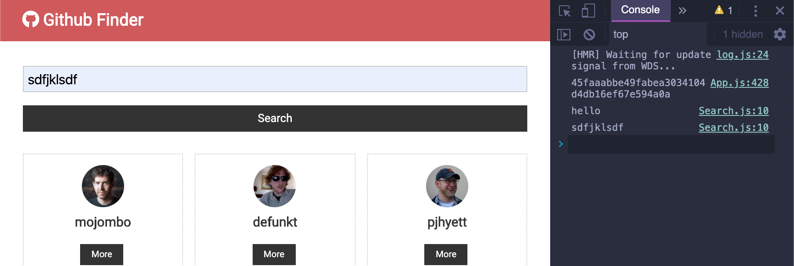
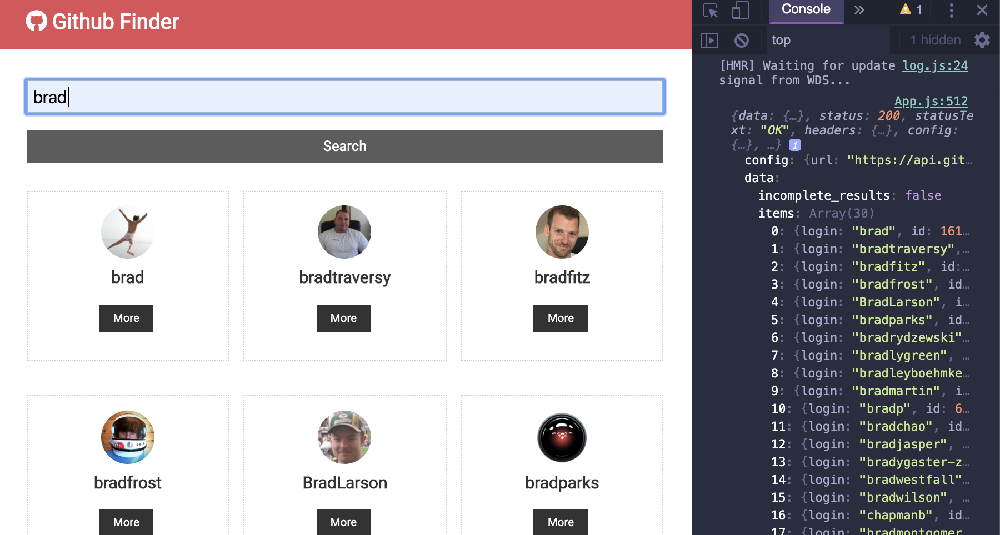
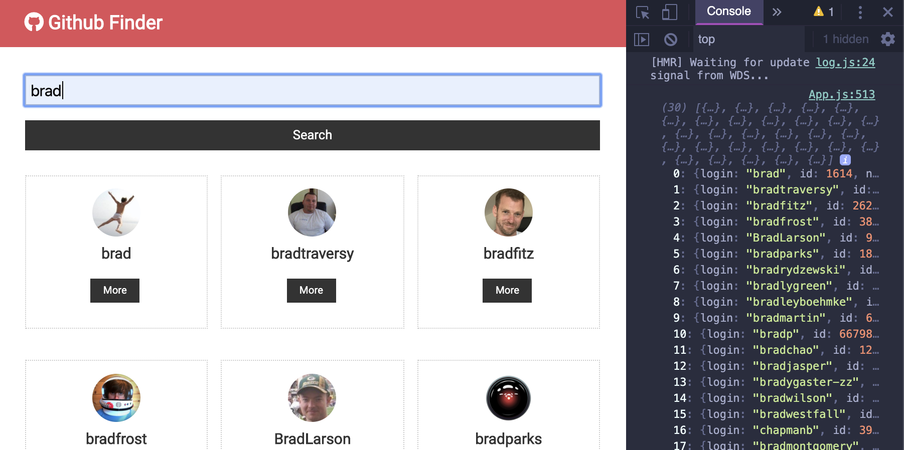

## Events & Search Component
- create a `Search.js` in `users` folder
-
```js
import React, { Component } from 'react'
export class Search extends Component {
    state = {
        text: ''
    }
    onChange = (e) => {
        this.setState({ text: e.target.value });
    }
    render() {
        return (
            <div>
                <form className="form">
                    <input type="text" name="text" placeholder="Search Users..."
                        value={this.state.text}
                        onChange={this.onChange}
                    />
                    <input type="submit" value="Search" className="btn btn-dark btn-block" />
                </form>
            </div>
        )
    }
}
export default Search
```


- But we could have multiple React inputs having a different `name` property and using the same `onChange` handler to update part of the state
- `https://stackoverflow.com/questions/50376353/wy-we-need-to-put-e-target-name-in-square-brackets`
-
- let's say we had like `name email address` whatever if we had a bunch of different fields
- Search.js
```js
import React, { Component } from 'react'

export class Search extends Component {
    state = {
        text: ''
    }

    onSubmit = (e) => {
        e.preventDefault();
        console.log(this.state.text);
    }

    onChange = (e) => {
        this.setState({ [e.target.name]: e.target.value });
    }
    render() {
        return (
            <div>
                <form onSubmit={this.onSubmit} className="form">
                    <input type="text" name="text" placeholder="Search Users..."
                        value={this.state.text}
                        onChange={this.onChange}
                    />
                    <input type="submit" value="Search" className="btn btn-dark btn-block" />
                </form>
            </div>
        )
    }
}
export default Search
```

---

## Passing Props Up & Search
- update App.js
```js
//Passing Props Up & Search
import React, { Component } from 'react';
import Navbar from './components/layout/Navbar';
import Users from './components/users/Users';
import Search from './components/users/Search';
import axios from 'axios';
import './App.css';
class App extends Component {
  state = {
    users: [],
    loading: false
  }

  //Search Github users
  searchUsers = async (text) => {
    this.setState({ loading: true });
    const res = await axios.get(`https://api.github.com/search/users?q=${text}
    &client_id=${process.env.REACT_APP_GITHUB_CILENT_ID}
    &client_secret=${process.env.REACT_APP_GITHUB_CILENT_SECRET}`);

    console.log(res);
    // console.log(res.data);
    // console.log(res.data.items);
    this.setState({ users: res.data.items, loading: false });
  }
  render() {
    return (
      <div className="App">
        <Navbar />
        <div className='container'>
          <Search searchUsers={this.searchUsers} />
          <Users loading={this.state.loading} users={this.state.users} />
        </div>
      </div>
    );
  }
}
export default App;
```

-
- so we assign, `res.data.items` to `users`
- update App
```js
  searchUsers = async (text) => {
    this.setState({ loading: true });
    const res = await axios.get(`https://api.github.com/search/users?q=${text}
    &client_id=${process.env.REACT_APP_GITHUB_CILENT_ID}
    &client_secret=${process.env.REACT_APP_GITHUB_CILENT_SECRET}`);
    this.setState({ users: res.data.items, loading: false });
  }
```

-
- update Search.js
```js
//Passing Props Up & Search
import React, { Component } from 'react'
import PropTypes from 'prop-types'
export class Search extends Component {
    state = {
        text: ''
    }

    static propTypes = {
        searchUsers: PropTypes.func.isRequired
    };

    onSubmit = (e) => {
        e.preventDefault();
        this.props.searchUsers(this.state.text);
        this.setState({ text: '' });
    }

    onChange = (e) => {
        this.setState({ [e.target.name]: e.target.value });
    }
    render() {
        return (
            <div>
                <form onSubmit={this.onSubmit} className="form">
                    <input type="text" name="text" placeholder="Search Users..."
                        value={this.state.text}
                        onChange={this.onChange}
                    />
                    <input type="submit" value="Search" className="btn btn-dark btn-block" />
                </form>
            </div>
        )
    }
}
export default Search
```


